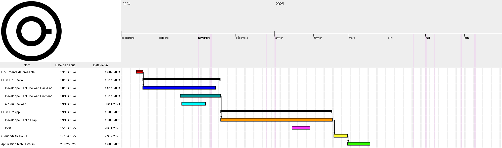
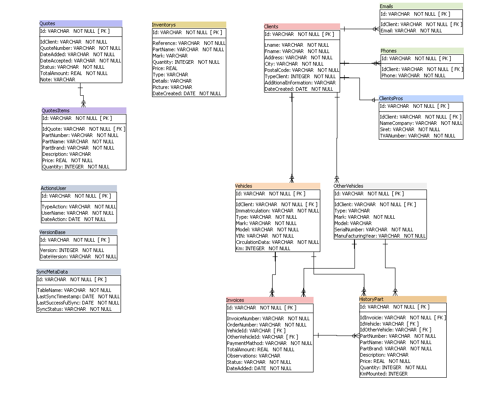

Voici une version mise à jour du README en tenant compte des nouvelles informations que vous avez fournies :

---

# Gestionnaire de Garages Multiplateforme 🚗🔧

Une solution tout-en-un pour les indépendants et petites équipes de garages. Ce projet est une application web et mobile multiplateforme conçue pour optimiser la gestion des garages.

## 📝 Description du projet

L'application permet aux garages de 1 à 10 personnes de :

- Gérer efficacement les clients et véhicules à entretenir.
- Générer des factures électroniques conformes aux normes obligatoires de l'État français.
- Créer des devis, des ordres de réparation et des factures.
- Suivre les stocks de pièces détachées grâce à une fonctionnalité de gestion d'inventaire.

Cette solution offre un **gain de temps significatif** pour les petits garages tout en assurant une **gestion fluide des documents** et une **historisation complète** des factures et devis.

---

## 🎯 Objectifs et fonctionnalités principales

- **Connexion sécurisée** : Protection des données via une authentification sécurisée et des protocoles de chiffrement.
- **Gestion des clients** : Stockage et gestion des informations des clients.
- **Suivi des véhicules** : Enregistrement des détails des véhicules et de l'historique complet des réparations.
- **Devis et facturation** : Création de devis détaillés et génération de factures électroniques conformes.
- **Gestion des stocks** : Suivi de l'inventaire des pièces détachées et consommables.
- **Ordres de réparation** : Création et suivi des ordres de réparation.
- **Rapports et analyses** : Génération de statistiques et tableaux de bord pour analyser l'activité.
- **Fonctionnalité offline** : Utilisation de l'application même sans connexion internet.

---

## 🚀 Technologies utilisées

 


---

## 🌟 Gants



---

## 📊 Schéma de la base de données



---

## 📥 Installation

1. Cloner le projet :
   ```bash
   git clone https://github.com/FilleuxStudio/Facilys.git
   ```
2. Accéder au dossier du projet :
   ```bash
   cd Facilys
   ```
3. Installer les dépendances côté serveur :
   ```bash
   dotnet restore
   ```
4. Installer les dépendances côté client :
   ```bash
   npm install
   ```

---

## 🔧 Déploiement et exécution

Pour exécuter l'application en mode développement :

1. Lancer le backend .NET Core :
   ```bash
   dotnet run
   ```
2. Lancer le frontend avec Electron.NET :
   ```bash
   npm start
   ```

---

## 📚 Documentation

La documentation complète de l'API et des fonctionnalités est disponible dans le dossier `/Docs`.

---

## 📄 Licence

Ce projet est sous licence MIT. Voir le fichier [LICENSE](LICENSE) pour plus de détails.